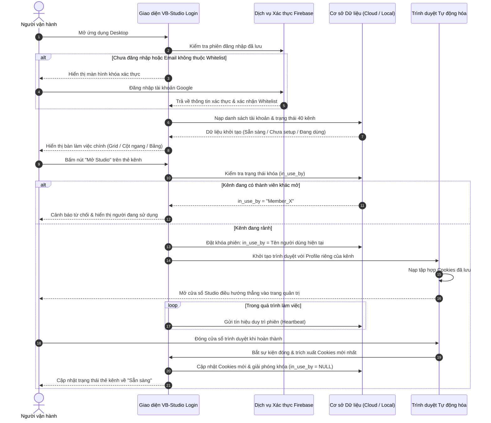

# 1. Tổng quan Hệ thống VB-Studio Login

## 1.1. Bối cảnh & Mục tiêu

**VB-Studio Login** là giải pháp phần mềm máy trạm (Desktop Client) chuyên dụng được xây dựng nhằm đáp ứng nhu cầu quản trị và vận hành tập trung hệ thống kênh truyền thông đa nền tảng cho đội ngũ sáng tạo nội dung và vận hành mạng xã hội (từ 3 đến 5 nhân sự).

Hệ thống hỗ trợ quản lý cấu trúc đa cấp:
- **Tập hợp tài khoản gốc (Accounts):** Các tài khoản đăng nhập trung tâm (Google / Email doanh nghiệp).
- **Hệ thống kênh phân nhánh (Channels):** Mỗi tài khoản gốc có thể phân nhánh thành nhiều kênh mạng xã hội chuyên biệt:
  - **YouTube:** Kênh YouTube chính và hệ thống quản trị YouTube Studio.
  - **TikTok:** Kênh TikTok và trung tâm sáng tạo TikTok Creator Center.
  - **Facebook:** Trang fanpage / tài khoản quản trị trên Meta Business Suite & Reels Composer.
  - **Instagram:** Tài khoản Instagram chuyên nghiệp và giao diện quản trị Meta.
  - **Nền tảng tùy biến (Custom Platforms):** Mở rộng linh hoạt thêm các mạng xã hội khác thông qua danh mục nền tảng động.

---

## 1.2. Các Vấn đề Nghiệp vụ & Giải pháp

Trong quá trình quản lý đồng thời hàng chục kênh mạng xã hội với nhiều nhân sự cùng làm việc, các đội ngũ thường gặp phải các trở ngại nghiêm trọng:

### 1. Tránh xung đột phiên làm việc và bảo vệ tài khoản
- **Vấn đề:** Nhiều thành viên cùng đăng nhập vào một kênh cùng một lúc từ các máy tính khác nhau dễ dẫn đến tình trạng nền tảng nghi ngờ hoạt động bất thường, hủy phiên đăng nhập hoặc yêu cầu xác minh bảo mật nhiều lớp liên tục.
- **Giải pháp của VB-Studio Login:** Ứng dụng triển khai cơ chế khóa phiên độc quyền (**Session Lock - `in_use_by`**). Khi một thành viên mở kênh, hệ thống tự động ghi nhận định danh người dùng và thời điểm bắt đầu; các thành viên khác trên mạng sẽ thấy trạng thái kênh đang bận và bị ngăn chặn việc mở trùng lặp.

### 2. Loại bỏ việc đăng nhập thủ công và nhập mã 2FA lặp lại
- **Vấn đề:** Việc đăng nhập hàng ngày bằng tài khoản, mật khẩu và yêu cầu mã xác thực 2FA (SMS/Authenticator) làm gián đoạn tiến độ công việc và gây phụ thuộc vào người giữ thiết bị nhận mã OTP.
- **Giải pháp của VB-Studio Login:** Cơ chế **1-Click Studio Launch** lưu trữ và tái sử dụng phiên làm việc an toàn. Sau lần xác thực đầu tiên, các lần khởi chạy sau sẽ đưa thành viên đi thẳng vào trang Creator Studio của kênh trong vòng 1 cú nhấp chuột mà không bao giờ hỏi lại mật khẩu.

### 3. Đồng bộ dữ liệu phiên hai chiều (Two-Way Session Sync)
- **Vấn đề:** Khi một thành viên thao tác và nền tảng cấp mới mã phiên (Session Cookie), các máy tính khác nếu không được cập nhật sẽ sử dụng cookie cũ đã hết hạn, dẫn đến việc bị đẩy ra màn hình đăng nhập.
- **Giải pháp của VB-Studio Login:** Tự động lắng nghe sự kiện kết thúc phiên làm việc, trích xuất toàn bộ cookie hợp lệ mới nhất và cập nhật ngay lên cơ sở dữ liệu dùng chung (Firebase Realtime Database hoặc máy chủ PostgreSQL). Các máy trạm khác sẽ ngay lập tức nhận được phiên làm việc mới nhất.

### 4. Cách ly môi trường trình duyệt hoàn toàn (Isolated Persistent Profiles)
- **Vấn đề:** Dùng chung trình duyệt thông thường dễ gây nhiễm chéo dữ liệu duyệt web, lịch sử, cache và đặc biệt là cookie giữa các tài khoản, dẫn đến việc nhầm lẫn tài khoản khi đăng tải nội dung.
- **Giải pháp của VB-Studio Login:** Mỗi kênh sở hữu một thư mục hồ sơ người dùng độc lập trong `./profiles/{channel_id}`. Dữ liệu bộ nhớ tạm, lưu trữ cục bộ và cấu hình duyệt web được phân tách triệt để.

---

## 1.3. Luồng Hoạt động Tổng thể (End-to-End Workflow)

Sơ đồ tuần tự thể hiện toàn bộ quy trình từ lúc người dùng khởi chạy ứng dụng đến khi hoàn thành công việc:

---

## 1.4. Mô hình Bảo mật & Kiểm soát Truy cập

Hệ thống thiết lập 3 lớp kiểm soát an toàn nghiêm ngặt:

1. **Lớp Xác thực Người dùng (Authentication Gate):**
   - Ứng dụng bắt buộc đăng nhập tài khoản Google qua Firebase Authentication trước khi cho phép truy cập bàn làm việc chính.
   - Kiểm tra đối chiếu chặt chẽ với danh sách địa chỉ email được ủy quyền (Whitelist). Những tài khoản ngoài danh sách sẽ bị từ chối truy cập ngay lập tức.
   - Phiên đăng nhập được duy trì an toàn và tự động phục hồi trong các phiên làm việc tiếp theo.

2. **Lớp Bảo vệ Cơ sở Dữ liệu Đám mây (Cloud Security Rules):**
   - Firebase Realtime Database áp dụng quy tắc an ninh (Security Rules) ở cấp độ máy chủ: chỉ những yêu cầu có mã xác thực hợp lệ và thuộc danh sách email được ủy quyền mới được phép đọc hoặc ghi dữ liệu.

3. **Lớp Bảo vệ Phiên Cục bộ (Local Session Safety):**
   - Hỗ trợ tính năng giải phóng phiên khẩn cấp (Force Unlock) cho quản trị viên trong tình huống thành viên quên đóng trình duyệt hoặc gặp sự cố ngắt kết nối mạng.

---

## 1.5. Ma trận Nền tảng & Cấu trúc Phân bổ Kênh

Mỗi tài khoản gốc đóng vai trò là một đơn vị quản trị mẹ, liên kết với 4 kênh phân nhánh tiêu chuẩn:

| Nền tảng | Mã định danh | Trang Quản trị Mặc định (Studio URL) | Trang Đăng nhập Gốc (Login URL) |
| :--- | :--- | :--- | :--- |
| **YouTube** | `YOUTUBE_SHORTS` | `https://studio.youtube.com` | `https://accounts.google.com/ServiceLogin?service=youtube` |
| **TikTok** | `TIKTOK` | `https://www.tiktok.com/creator-center/upload` | `https://www.tiktok.com/login` |
| **Facebook** | `FACEBOOK_REELS` | `https://business.facebook.com/latest/reels_composer` | `https://www.facebook.com/login` |
| **Instagram** | `INSTAGRAM_REELS` | `https://www.instagram.com/` | `https://www.instagram.com/accounts/login` |

Ngoài các nền tảng mặc định, hệ thống cho phép người dùng tùy ý bổ sung các nền tảng mạng xã hội mới thông qua mục cấu hình **Danh mục Mạng xã hội (Socials Registry)** mà không cần thay đổi mã nguồn.
