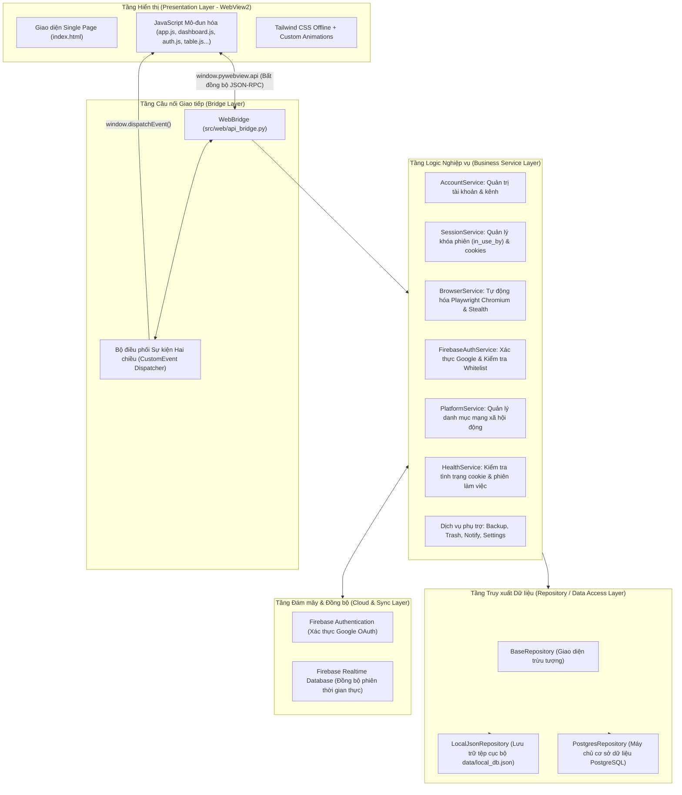

# 2. Kiến trúc Hệ thống & Thiết kế Kỹ thuật (Technical Architecture)

## 2.1. Phân tầng Kiến trúc (Layered Architecture)

Hệ thống **VB-Studio Login** được thiết kế theo mô hình kiến trúc phân tầng kết hợp hướng dịch vụ (Service-Oriented Architecture), đảm bảo tính tách biệt tuyệt đối giữa tầng giao diện hiển thị, tầng nghiệp vụ điều phối và tầng truy xuất dữ liệu:

---

## 2.2. Chi tiết các Phân tầng Kỹ thuật

### 1. Tầng Hiển thị (Presentation Layer)
- **Công nghệ nền tảng:** Microsoft Edge Chromium WebView2 được nhúng thông qua thư viện `pywebview`. Tận dụng khả năng tăng tốc phần cứng DirectX từ hệ điều hành, mang lại trải nghiệm 60–120 FPS mượt mà.
- **Tính độc lập mạng (Offline-First):** Toàn bộ thư viện CSS (Tailwind CSS) và các SDK cần thiết đều được lưu trữ trực tiếp trong thư mục `src/web/vendor/`. Ứng dụng khởi động tức thì và hoạt động bình thường ngay cả khi không có kết nối Internet (đối với chế độ Local).
- **Kiến trúc mã nguồn JavaScript mô-đun:**
  - `app.js`: Điểm khởi chạy giao diện, khởi tạo cấu hình và đăng ký lắng nghe sự kiện toàn cục.
  - `auth.js`: Điều khiển màn hình khóa xác thực (Auth Gate), hiển thị tiến trình đăng nhập và lưu trữ phiên.
  - `dashboard.js`: Điều phối hiển thị 3 chế độ xem (Lưới thẻ, Cột ngang tài khoản, Bảng dữ liệu) và thanh công cụ tìm kiếm.
  - `table.js`: Quản lý chế độ xem dạng bảng chi tiết, cho phép sắp xếp và thao tác hàng loạt.
  - `presence.js`: Quản lý tín hiệu hiện diện thời gian thực (ai đang mở kênh nào).
  - `channel_drawer.js`: Bảng trượt chi tiết thông tin kênh, chỉnh sửa liên kết và kiểm tra cookies.
  - `settings.js`: Trung tâm cấu hình (Database, Trình duyệt, Đội ngũ, Giao diện).
  - `socials.js`, `trash.js`, `health.js`, `vault.js`, `themes.js`, `sound.js`: Các phân hệ chức năng chuyên biệt.

### 2. Tầng Cầu nối Giao tiếp (Bridge Layer - `api_bridge.py`)
- Lớp `WebBridge` hoạt động như một bộ chuyển tiếp hai chiều:
  - **Từ Giao diện xuống Python:** Các hàm JavaScript gọi phương thức Python thông qua `window.pywebview.api.<method_name>(args...)`. Tất cả các lệnh gọi đều trả về `Promise`, không chặn luồng giao diện chính.
  - **Từ Python lên Giao diện:** Phương thức `notify_frontend(event_name, payload)` sử dụng cơ chế `evaluate_js` để kích hoạt các sự kiện tùy biến (`CustomEvent`), cho phép giao diện tự động cập nhật khi có dữ liệu mới từ các luồng chạy ngầm.

### 3. Tầng Dịch vụ Nghiệp vụ (Service Layer)
- **`FirebaseAuthService`:**
  - Khởi tạo máy chủ loopback tạm thời tại `http://localhost:52140` để nhận kết quả xác thực tài khoản Google từ trình duyệt hệ thống.
  - Thực hiện xác minh đối chiếu địa chỉ email với danh sách được cấp phép (Whitelist) được cấu hình bảo mật.
  - Quản lý mã phiên (Session Token) và lưu trữ cục bộ để duy trì đăng nhập cho các phiên khởi động kế tiếp.
- **`BrowserService`:**
  - Điều khiển trình duyệt Chromium thông qua Playwright.
  - Thiết lập hồ sơ bền vững (Persistent Context) theo từng kênh trong `./profiles/{channel_id}`.
  - Áp dụng cơ chế chống phát hiện tự động hóa (loại bỏ cờ nhận diện, ngụy trang kích thước khung nhìn và thông số phần cứng tự nhiên).
  - Lắng nghe tín hiệu đóng trình duyệt để tự động kích hoạt tiến trình trích xuất cookie.
- **`SessionService`:**
  - Xử lý cơ chế khóa phiên nguyên tử (Atomic Lock) trên trường `in_use_by` và `in_use_since`.
  - Thực hiện chuẩn hóa và mã hóa dữ liệu cookie sang định dạng JSON thống nhất.
  - Hỗ trợ cơ chế giải phóng phiên cưỡng chế (Force Unlock) khi có yêu cầu hợp lệ.
- **`AccountService`:**
  - Đóng vai trò Facade Service điều phối luồng nghiệp vụ giữa cơ sở dữ liệu, trình duyệt và phiên làm việc.
  - Đảm bảo tính nhất quán của dữ liệu khi thực hiện tạo mới, cập nhật hoặc xóa tài khoản và kênh.

### 4. Tầng Truy xuất Dữ liệu (Repository Layer)
- Được trừu tượng hóa thông qua lớp cơ sở `BaseRepository`.
- **`LocalJsonRepository`:**
  - Lưu trữ toàn bộ dữ liệu trong tệp `data/local_db.json`.
  - Phù hợp cho môi trường phát triển cục bộ hoặc các máy trạm độc lập.
- **`PostgresRepository`:**
  - Kết nối trực tiếp đến hệ thống cơ sở dữ liệu PostgreSQL (qua thư viện `psycopg2`).
  - Hỗ trợ cơ chế Connection Pool, tối ưu hóa các câu lệnh truy vấn đa người dùng và bảo đảm tính toàn vẹn dữ liệu giao dịch (ACID).

---

## 2.3. Áp dụng các Nguyên lý Thiết kế SOLID

Hệ thống được tổ chức tuân thủ nghiêm ngặt các nguyên lý thiết kế phần mềm hướng đối tượng:

1. **Single Responsibility Principle (SRP - Đơn trách nhiệm):**
   - Mỗi dịch vụ chỉ giải quyết một phạm vi công việc độc lập: `BrowserService` chỉ lo việc tự động hóa trình duyệt; `SessionService` chỉ chuyên trách khóa phiên và dữ liệu cookies; `FirebaseAuthService` chỉ đảm nhiệm xác thực quyền truy cập.
2. **Open/Closed Principle (OCP - Mở rộng nhưng đóng thay đổi):**
   - Muốn bổ sung thêm các nền tảng mạng xã hội mới (như Threads, X/Twitter), hệ thống sử dụng `PlatformService` và danh mục động mà không cần phải can thiệp hay sửa đổi logic cốt lõi của tầng điều khiển trình duyệt.
3. **Liskov Substitution Principle (LSP - Thay thế Liskov):**
   - `LocalJsonRepository` và `PostgresRepository` kế thừa toàn diện từ `BaseRepository`. Tầng dịch vụ nghiệp vụ (`AccountService`) có thể làm việc với bất kỳ kho dữ liệu nào mà không xuất hiện bất kỳ sai lệch nào về hành vi.
4. **Interface Segregation Principle (ISP - Phân tách giao diện):**
   - Các giao diện hàm được phân ranh giới rõ ràng; các thành phần không bị ép buộc phải phụ thuộc vào các phương thức mà chúng không có nhu cầu sử dụng.
5. **Dependency Inversion Principle (DIP - Đảo ngược phụ thuộc):**
   - Tầng điều phối nghiệp vụ không phụ thuộc trực tiếp vào các mô-đun cấp thấp cụ thể (như `psycopg2` hay hàm đọc file `json`), mà chỉ giao tiếp thông qua giao diện trừu tượng được truyền vào (Dependency Injection) tại tệp khởi động `main.py`.

---

## 2.4. Mô hình Xử lý Đa Luồng & Bất đồng bộ (Concurrency Model)

Để đảm bảo giao diện Desktop luôn phản hồi mượt mà và không bao giờ bị đơ (UI Freeze):

1. **Khởi chạy Trình duyệt Độc lập:** Mọi thao tác khởi chạy Chromium đều được đưa vào các luồng riêng biệt (`threading.Thread(daemon=True)`). Giao diện người dùng tiếp tục nhận lệnh và hiển thị trạng thái đang xử lý mà không bị chặn.
2. **Tiến trình Đồng bộ Nền (Background Auto-Refresh):** Hệ thống khởi tạo bộ định thời ngầm định kỳ (mặc định 15 giây) để cập nhật trạng thái các kênh từ cơ sở dữ liệu dùng chung và phát tín hiệu cho giao diện cập nhật trạng thái thời gian thực.
3. **Máy chủ Xác thực Tạm thời:** Máy chủ loopback xử lý xác thực tài khoản Google được chạy trên một luồng độc lập và tự động giải phóng tài nguyên ngay sau khi quy trình hoàn tất hoặc người dùng hủy thao tác.
